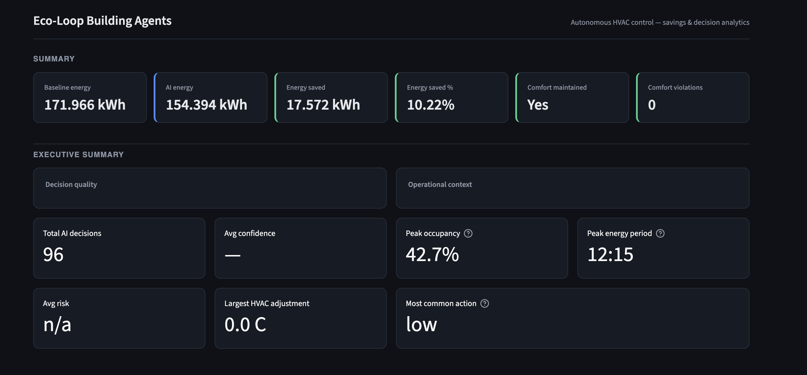
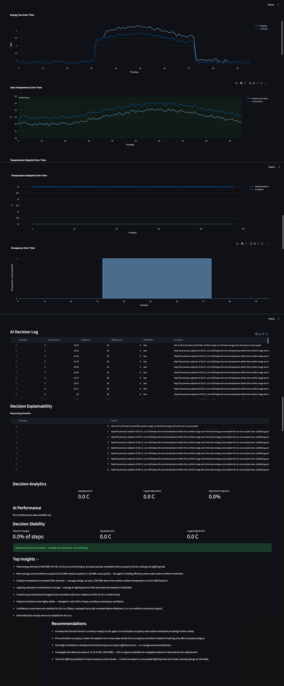

# Eco-Loop Building Agents
### Autonomous AI-Powered Building Energy Optimization using EnergyPlus, LLMs, and Closed-Loop Control

## Overview

Eco-Loop Building Agents is an autonomous building energy optimization system that integrates an LLM with an EnergyPlus-based digital twin to continuously monitor building conditions, reason about energy usage, and generate optimized HVAC control decisions.

Instead of relying on static schedules, the system forms a closed feedback loop where the AI continuously receives telemetry from the building simulation, evaluates occupancy, weather, comfort, and energy consumption, and updates HVAC set-points to reduce energy usage while maintaining occupant comfort.

This project was developed as a Proof of Concept for the Honeywell AI Hackathon.

---

## Features

- EnergyPlus building simulation
- Autonomous LLM-based decision making
- Closed-loop control architecture
- Deterministic replay mode for reproducible demonstrations
- Live LLM execution using Groq API
- Energy savings comparison against baseline
- Executive reporting
- Interactive Streamlit dashboard
- Comfort constraint validation
- Confidence and risk analysis
- Explainable AI decisions
- Decision history and analytics

---

# System Architecture

```
                    +-----------------------+
                    |     EnergyPlus        |
                    |  Building Simulation  |
                    +----------+------------+
                               |
                               |
                               v
                    Sensor Telemetry
                               |
                               v
                    +-----------------------+
                    |   Telemetry Parser    |
                    +-----------+-----------+
                                |
                                |
                                v
                     Context Builder
                                |
                                v
                    +-----------------------+
                    |       LLM Agent       |
                    | (Reasoning Engine)    |
                    +-----------+-----------+
                                |
                                |
                    AI HVAC Decisions
                                |
                                v
                    Verification Engine
                                |
                                v
                    Decision Memory
                                |
                                v
                    EnergyPlus Controller
                                |
                                |
                                v
                    Updated Building State
                                |
                                |
                         Feedback Loop
```

---

# Project Structure

```
eco-loop-agents/
│
├── app/
│   ├── analytics.py
│   ├── comparison.py
│   ├── controller.py
│   ├── forecasting.py
│   ├── main.py
│   ├── reporting.py
│   ├── replay.py
│   └── verifier.py
│
├── dashboard/
│   ├── dashboard_app.py
│   └── data_loader.py
│
├── data/
│   ├── baseline_run_log.jsonl
│   ├── ai_run_log.jsonl
│   ├── demo_transcript.jsonl
│   ├── savings_summary.json
│   └── executive_summary.json
│
├── reports/
│   └── report.md
│
├── config.yaml
├── requirements.txt
└── README.md
```

---

# Closed-Loop Workflow

1. EnergyPlus generates building telemetry.
2. Sensor data is converted into structured context.
3. The LLM analyzes:
   - Indoor temperature
   - Outdoor weather
   - Occupancy
   - HVAC load
   - Energy consumption
4. The AI recommends HVAC set-point adjustments.
5. The verifier validates the recommendation.
6. The controller applies approved actions.
7. Updated telemetry is streamed back into the system.
8. Reports and dashboards are generated automatically.

---

# AI Decision Pipeline

```
EnergyPlus
      │
      ▼
Telemetry
      │
      ▼
Context Builder
      │
      ▼
LLM Reasoning
      │
      ▼
Decision Verification
      │
      ▼
Controller
      │
      ▼
Updated Building
      │
      ▼
Dashboard + Reports
```

---

# Technologies Used

### Simulation

- EnergyPlus

### AI

- Groq API
- Llama Models

### Backend

- Python

### Dashboard

- Streamlit
- Plotly

### Data

- JSON
- JSONL
- YAML

---

# Running the Project

## Clone Repository

```bash
git clone https://github.com/nirajguptaa/eco-loop-building-agents.git

cd eco-loop-building-agents
```

---

## Create Virtual Environment

```bash
python -m venv venv
```

Activate

Mac/Linux

```bash
source venv/bin/activate
```

Windows

```bash
venv\Scripts\activate
```

---

## Install Dependencies

```bash
pip install -r requirements.txt
```

---

## Configuration

Edit `config.yaml`

### Replay Demo (Recommended)

```yaml
demo_mode: true
```

Runs using the deterministic replay transcript and reproduces the demo without requiring an API key.

### Live AI Mode

```yaml
demo_mode: false
```

Provide your Groq API key in the environment before running.

---

# Execute

Generate AI run

```bash
python -m app.main
```

Generate comparison

```bash
python -m app.comparison
```

Generate reports

```bash
python -m app.reporting
```

Launch dashboard

```bash
streamlit run dashboard/dashboard_app.py
```

---

# Results

## Baseline Performance

- Total Energy Consumption: **171.966 kWh**
- Comfort Violations: **0**

## AI Optimized Performance

- Total Energy Consumption: **154.394 kWh**
- Comfort Violations: **0**

## Performance Improvement

| Metric | Result |
|---------|--------|
| Energy Saved | **17.572 kWh** |
| Energy Reduction | **10.22%** |
| Comfort Maintained | **Yes** |
| Comfort Violations | **0** |

## Dashboard Preview

### Executive Summary



Displays the overall energy savings, comfort validation, executive KPIs, and AI performance summary.

### Interactive Analytics Dashboard



Visualizes energy consumption, temperature trends, occupancy, AI decision logs, explainability, analytics, insights, and recommendations.

---

# Dashboard

The Streamlit dashboard includes:

- Executive Summary
- Energy Comparison
- Energy Savings
- Comfort Validation
- AI Decision Analytics
- Confidence Scores
- Risk Distribution
- HVAC Adjustments
- Recommendations

---

# Key Capabilities

- Autonomous reasoning
- Closed-loop control
- Explainable AI decisions
- Deterministic replay
- Energy savings analysis
- Comfort preservation
- Executive reporting
- Interactive visualization

---


# Hackathon Deliverables

- Source Code
- Closed-loop AI Controller
- EnergyPlus Integration
- Quantitative Savings Dashboard
- Executive Report
- System Architecture
- Demonstration Video

---

# Authors

**Niraj Kumar Gupta**

VIT Chennai

Computer Science & Engineering

---

# Acknowledgements

Developed as part of the **Honeywell AI Hackathon**, demonstrating autonomous AI-driven building energy optimization using EnergyPlus and Large Language Models.

---

# License

This project was developed for the Honeywell AI Hackathon for educational and demonstration purposes.